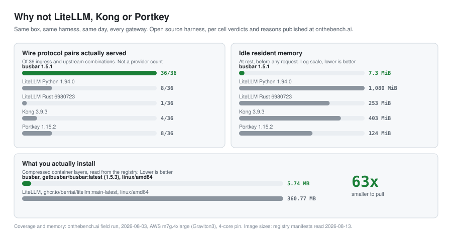
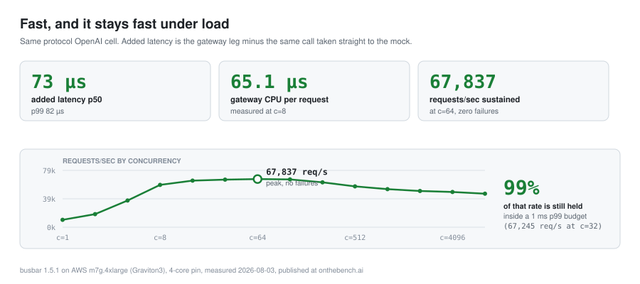
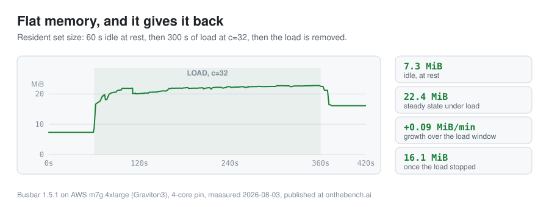

<p align="center">
  
</p>

<h1 align="center">busbar</h1>

<p align="center"><strong>Your AI control plane, in one static Rust binary.</strong><br>
Point any SDK at one URL, reach any provider, and keep serving when a provider does not.</p>

<p align="center">
<a href="https://github.com/GetBusbar/busbar/actions/workflows/ci.yml"></a>
<a href="https://github.com/GetBusbar/busbar/releases"></a>
<a href="https://hub.docker.com/r/getbusbar/busbar"></a>
<a href="LICENSE"></a>
</p>

<picture>
  <source media="(prefers-color-scheme: dark)" srcset="assets/readme/matrix-dark.svg">
  
</picture>

Six wire protocols, first class on both sides: OpenAI, OpenAI Responses, Anthropic, Gemini, Cohere and Bedrock Converse. Same-protocol routes are byte-for-byte identical to calling the provider directly, because busbar forwards your original bytes rather than re-serializing them; cross-protocol, every modelled field arrives in the target's native shape, and anything that cannot cross is dropped deliberately and logged rather than mangled.

Self-hosted, always. No hosted service, no signup, nothing phones home, and your provider keys stay in your own config on your own machine.

---

## Two lines

Your app already speaks one of those six protocols. Change the base URL and the key, and the model name becomes a config value instead of a code dependency.

```diff
- client = OpenAI(api_key=OPENAI_KEY)
+ client = OpenAI(api_key=BUSBAR_TOKEN, base_url="http://localhost:8080/v1")

  # "fast" is a pool you define in config: 80% Claude, 20% GPT, Bedrock on failover
  client.chat.completions.create(model="fast", messages=[{"role": "user", "content": "Hi"}])
```

That request left as OpenAI, may have been served by Anthropic, and came back as OpenAI. If Anthropic had failed before the first byte, busbar would have moved to the next lane without your client noticing.

<details>
<summary><strong>The same swap in the other five SDKs</strong></summary>

```python
# Anthropic: the SDK appends /v1/messages, so the pool name goes in the base URL
import anthropic
client = anthropic.Anthropic(api_key="busbar-token", base_url="http://localhost:8080/fast")
client.messages.create(model="ignored", max_tokens=1024, messages=[{"role": "user", "content": "Hi"}])

# OpenAI Responses: same client as above, same base URL
client.responses.create(model="fast", input="Hi")

# Gemini
from google import genai
from google.genai import types
client = genai.Client(api_key="busbar-token",
                      http_options=types.HttpOptions(base_url="http://localhost:8080"))
client.models.generate_content(model="fast", contents="Hi")

# Cohere v2
import cohere
client = cohere.ClientV2(api_key="busbar-token", base_url="http://localhost:8080")
client.chat(model="fast", messages=[{"role": "user", "content": "Hi"}])

# Bedrock Converse: a SigV4 boto3 client, load balanced across non-Bedrock backends
import boto3
client = boto3.client("bedrock-runtime", region_name="us-east-1",
                      endpoint_url="http://localhost:8080")
client.converse(modelId="fast", messages=[{"role": "user", "content": [{"text": "Hi"}]}])
```

Every one of these was run against busbar 1.5.3 while writing this file. Full route and auth reference: [Protocols](https://getbusbar.com/docs/protocols/).

</details>

---

## Run it

One binary and one YAML file. No interpreter, no database, no sidecar.

```bash
curl -fsSL https://getbusbar.com/install.sh | sh      # busbar + providers.yaml into ./

cat > config.yaml <<'EOF'
providers:
  anthropic: { api_key: { env: ANTHROPIC_KEY } }   # the NAME of the env var, never the key
models:
  claude: { provider: anthropic, upstream_model: claude-sonnet-4-5 }
pools:
  fast:
    members:
      - { model: claude, weight: 1 }
EOF

export ANTHROPIC_KEY=sk-ant-...
BUSBAR_CONFIG=./config.yaml ./busbar &

curl -s localhost:8080/v1/chat/completions -H 'content-type: application/json' \
  -d '{"model":"fast","messages":[{"role":"user","content":"Hello!"}]}'
```

Or the container, which ships a bootable default config, so one line is the whole thing:

```bash
docker run --rm -p 8080:8080 -e ANTHROPIC_KEY -e BUSBAR_ADMIN_TOKEN getbusbar/busbar
```

`busbar --validate` parses your config and every provider reference and exits non-zero on anything wrong, with no server, no network and no state, so it belongs in CI. Full walkthrough: [Getting started](https://getbusbar.com/docs/getting-started/).

---

## Kubernetes

One container, no sidecar, nothing to run beside it. The image is 5.74 MB compressed and the process idles at 7.3 MiB, both stamped in the comparison below, so it fits a 32Mi request and a 128Mi limit with room to spare.

```bash
helm repo add busbar https://getbusbar.github.io/helm-charts
helm install busbar busbar/busbar -f my-values.yaml
```

<details>
<summary><strong>Plain Deployment, Service and ConfigMap, without Helm</strong></summary>

```yaml
apiVersion: v1
kind: ConfigMap
metadata: { name: busbar-config }
data:
  config.yaml: |
    listen: "0.0.0.0:8080"
    config: { locked: true }          # GitOps: config changes ship as a new ConfigMap
    providers:
      anthropic: { api_key: { env: ANTHROPIC_KEY } }
      openai:    { api_key: { env: OPENAI_KEY } }
    models:
      claude: { provider: anthropic, upstream_model: claude-sonnet-4-5, max_concurrent: 20 }
      gpt:    { provider: openai,    upstream_model: gpt-4o,            max_concurrent: 20 }
    pools:
      fast:
        members:
          - { model: claude, weight: 8 }
          - { model: gpt,    weight: 2 }
---
apiVersion: apps/v1
kind: Deployment
metadata: { name: busbar }
spec:
  replicas: 2
  selector: { matchLabels: { app: busbar } }
  template:
    metadata: { labels: { app: busbar } }
    spec:
      containers:
        - name: busbar
          image: getbusbar/busbar:1.5.3
          env:
            - { name: BUSBAR_CONFIG, value: /etc/busbar/config.yaml }
          envFrom:
            - secretRef: { name: busbar-keys }     # ANTHROPIC_KEY, OPENAI_KEY
          ports: [ { name: http, containerPort: 8080 } ]
          readinessProbe: { httpGet: { path: /healthz, port: http } }
          livenessProbe:  { httpGet: { path: /healthz, port: http } }
          resources:
            requests: { cpu: 100m, memory: 32Mi }
            limits:   { memory: 128Mi }
          securityContext:
            runAsNonRoot: true
            runAsUser: 65532
            readOnlyRootFilesystem: true
            allowPrivilegeEscalation: false
            capabilities: { drop: [ ALL ] }
          volumeMounts:
            - { name: config, mountPath: /etc/busbar, readOnly: true }
      volumes:
        - name: config
          configMap: { name: busbar-config }
---
apiVersion: v1
kind: Service
metadata: { name: busbar }
spec:
  selector: { app: busbar }
  ports: [ { name: http, port: 80, targetPort: http } ]
```

`config: { locked: true }` is what lets the root filesystem be read-only: a mutable config needs a writable overlay path and busbar refuses to boot without one. This Service is cluster-internal and the data plane has no auth chain, so turn on virtual keys before you expose it ([Governance](https://getbusbar.com/docs/guides/governance/)).

</details>

---

## Pools, weights and failover

This is the part you cannot easily build yourself. A pool is a weighted group of lanes that share a circuit breaker; a lane that fails before the first byte is replaced mid-request, and the breaker attributes the fault so a bad key benches one lane instead of tripping a healthy one.

```yaml
providers:
  anthropic:       { api_key: { env: ANTHROPIC_KEY } }
  openai:          { api_key: { env: OPENAI_KEY } }
  bedrock:         { api_key: { env: AWS_KEYPAIR } }   # ACCESS_KEY_ID:SECRET_ACCESS_KEY

models:
  claude:      { provider: anthropic, upstream_model: claude-sonnet-4-5, max_concurrent: 40 }
  gpt:         { provider: openai,    upstream_model: gpt-4o,            max_concurrent: 40 }
  claude-aws:  { provider: bedrock,   upstream_model: "anthropic.claude-3-5-sonnet-20241022-v2:0" }

pools:
  fast:
    members:
      - { model: claude,     weight: 8 }   # 80 percent of traffic
      - { model: gpt,        weight: 2 }   # 20 percent
      - { model: claude-aws, weight: 1 }   # same model, other cloud, picks up load when the others trip
    breaker:
      trip: { mode: consecutive, consecutive_n: 3 }
      base_cooldown_secs: 15
    failover:
      timeout_secs: 20
      max_hops: 2
```

Your client never sees the hop, even mid-stream. The state machine, the fault classes and the recovery probe are in [Reliability](https://getbusbar.com/docs/reliability/).

---

## Why not LiteLLM, Kong or Portkey

<picture>
  <source media="(prefers-color-scheme: dark)" srcset="assets/readme/field-dark.svg">
  
</picture>

Every figure below is the same box, the same harness and the same day, published cell by cell with its own verdict and reason at [onthebench.ai](https://onthebench.ai). The harness is ours and it is open source, so you can disagree with it in public.

| Measured 2026-08-03, AWS m7g.4xlarge, 4-core pin | busbar 1.5.1 | LiteLLM Python 1.94.0 | LiteLLM Rust 6980723 | Kong 3.9.3 | Portkey 1.15.2 |
|---|---|---|---|---|---|
| Wire protocol pairs served, of 36 | **36** | 8 | 1 | 4 | 8 |
| Added latency p99, best cell | **82 µs** | 8,221 µs | 106 µs | 389 µs | 3,720 µs |
| Gateway CPU per request, c=8 | **65 µs** | 6,775 µs | 89 µs | 210 µs | 1,486 µs |
| Requests/sec, zero failures | **67,837** | 170 | 48,354 | 22,418 | 855 |
| Added time to first token, streaming p50 | **129 µs** | 9,088 µs | 181 µs | 105,907 µs | 27,908 µs |
| Idle resident memory | **7.3 MiB** | 1,080 MiB | 253 MiB | 403 MiB | 124 MiB |

Each gateway is measured on its own best cell, which for LiteLLM Rust is its Anthropic diagonal, the one pair of the 36 it served, and for the others their OpenAI diagonal. Read the coverage row carefully: it counts ingress and upstream **wire protocol** pairs, not providers. LiteLLM's provider catalogue is far larger than busbar's, and that is a real reason to pick it. What the row says is that LiteLLM takes OpenAI-shaped ingress into any provider plus two native diagonals, so a Gemini SDK or a SigV4 boto3 client cannot address a non-Gemini, non-Bedrock backend through it. LiteLLM's Rust gateway is early beta with a deliberately narrow surface today, and its published sub-millisecond overhead is the same class as ours, so the honest difference there is scope, not speed.

Kong is a general API gateway with an LLM plugin bolted on, and the streaming row is where that shows: 106 ms of added time to first token against our 129 µs, on the same box. Portkey is a Node gateway and sustained 855 requests/sec on four cores where busbar sustained 67,837.

**What you install** is the first thing you feel. Measured today, `getbusbar/busbar:latest` is 5.74 MB of compressed layers against 360.77 MB for `ghcr.io/berriai/litellm:main-latest`, both linux/amd64, read straight from the registry manifests. Outside a container the gap is the same shape: one 12.4 MiB static binary, or `pip install 'litellm[proxy]'`, which put 558 MiB across 107 packages into a clean virtualenv when we ran it. Longer form, with citations to each vendor's own documentation: [busbar vs LiteLLM](https://getbusbar.com/docs/vs-litellm/).

---

## The numbers

<picture>
  <source media="(prefers-color-scheme: dark)" srcset="assets/readme/perf-dark.svg">
  
</picture>

<picture>
  <source media="(prefers-color-scheme: dark)" srcset="assets/readme/memory-dark.svg">
  
</picture>

Latency, throughput and memory come from the same neutral run on the same box: busbar 1.5.1 on an AWS m7g.4xlarge (Graviton3) pinned to 4 cores, measured 2026-08-03. Memory here is the same-protocol OpenAI cell; across all 36 cells idle stayed between 7.32 and 7.42 MiB and every cell reached a steady state.

---

## What else is in the box

Fault-attributed circuit breaking and in-flight failover, weighted pools with session affinity and per-lane concurrency caps, five built-in routing policies plus your own hook or an out-of-process sidecar, native TLS and mTLS with no reverse proxy in front, virtual keys with group budgets and spend tracking, a verified provider catalogue plus any provider on the six protocols in a few lines of YAML, and observability over open standards: Prometheus, OTLP and a per-request audit webhook.

The SemVer-protected contract is the runtime: the data-plane HTTP surface and the six wire-protocol contracts do not break inside a major version. `config.yaml` is an operator artifact, outside that freeze, and changes always ship with `busbar --migrate-config` and a loud fail-closed boot rather than a silent behaviour change.

Single Rust binary, MSRV 1.97, Apache-2.0. Docs at [getbusbar.com](https://getbusbar.com), contributor docs in [`docs/`](docs/).
