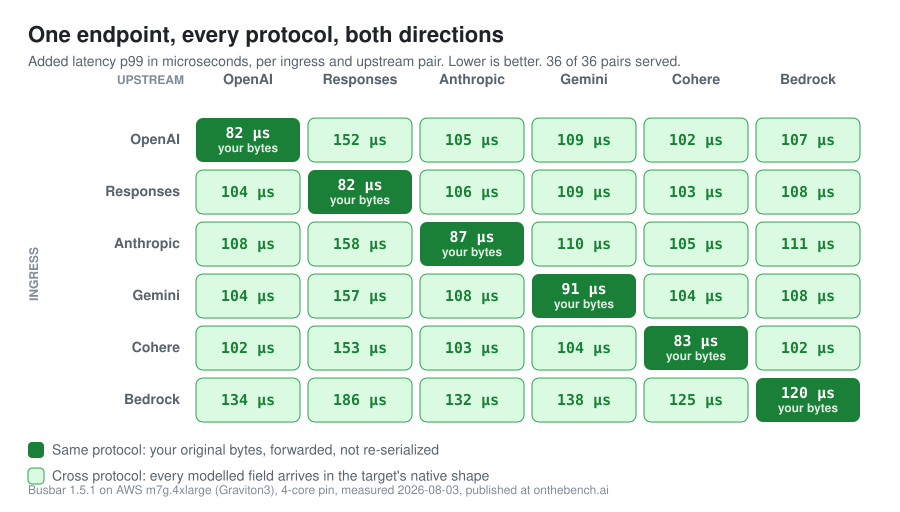

<!--
  This file is the GitHub ORG PROFILE readme. It renders at https://github.com/GetBusbar
  only when it lives in the private repo GetBusbar/.github at the path profile/README.md.

  To publish: copy this file to profile/README.md in GetBusbar/.github, and copy the
  org-profile/assets/ directory next to it as profile/assets/. The image paths below are
  relative and assume that layout. The SVGs are generated from onthebench.ai data and are
  regenerated when the field is re-measured; keep the two copies in step.
-->

<p align="center">
  
</p>

<h1 align="center">Busbar</h1>

<p align="center"><strong>Your AI control plane, in one static Rust binary.</strong><br>
Point any SDK at one URL, reach any provider, and keep serving when a provider does not.</p>

<picture>
  <source media="(prefers-color-scheme: dark)" srcset="assets/matrix-dark.svg">
  
</picture>

Six wire protocols, first class on both sides, in either direction. Same-protocol routes are byte-for-byte identical to calling the provider directly, because busbar forwards your original bytes; cross-protocol, every modelled field arrives in the target's native shape.

Self-hosted, always. No hosted service, no signup, nothing phones home, and your provider keys stay in your own config on your own machine.

## Two lines

```diff
- client = OpenAI(api_key=OPENAI_KEY)
+ client = OpenAI(api_key=BUSBAR_TOKEN, base_url="http://localhost:8080/v1")

  # "fast" is a pool you define in config: 80% Claude, 20% GPT, Bedrock on failover
  client.chat.completions.create(model="fast", messages=[{"role": "user", "content": "Hi"}])
```

That request left as OpenAI, may have been served by Anthropic, and came back as OpenAI. If Anthropic had failed before the first byte, busbar would have moved to the next lane without your client noticing.

## Why not LiteLLM, Kong or Portkey

<picture>
  <source media="(prefers-color-scheme: dark)" srcset="assets/field-dark.svg">
  
</picture>

Same box, same harness, same day, published cell by cell with its own verdict and reason at [onthebench.ai](https://onthebench.ai). Busbar served all 36 ingress and upstream wire-protocol pairs where LiteLLM served 8, Portkey 8 and Kong 4, at 7.3 MiB idle and 5.74 MB of compressed image against 360.77 MB for LiteLLM's.

The full table, with what each row does and does not say, is in the [busbar README](https://github.com/GetBusbar/busbar#why-not-litellm-kong-or-portkey).

## Repositories

| | |
|---|---|
| **[busbar](https://github.com/GetBusbar/busbar)** | The gateway. One static Rust binary, Apache-2.0. |
| [helm-charts](https://github.com/GetBusbar/helm-charts) · [terraform-provider-busbar](https://github.com/GetBusbar/terraform-provider-busbar) · [pulumi-busbar](https://github.com/GetBusbar/pulumi-busbar) · [provider-busbar](https://github.com/GetBusbar/provider-busbar) | Deploy it: Helm, Terraform, Pulumi, Crossplane. |
| [busbar-admin](https://github.com/GetBusbar/busbar-admin) · [busbar-go](https://github.com/GetBusbar/busbar-go) · [busbar-python](https://github.com/GetBusbar/busbar-python) · [busbar-js](https://github.com/GetBusbar/busbar-js) | Drive the admin API: a CLI and typed clients. |
| [store-postgres](https://github.com/GetBusbar/store-postgres) · [store-mysql](https://github.com/GetBusbar/store-mysql) · [store-sqlite](https://github.com/GetBusbar/store-sqlite) · [store-valkey](https://github.com/GetBusbar/store-valkey) | Governance state, shared across a cluster. |
| [auth-oidc](https://github.com/GetBusbar/auth-oidc) · [auth-github](https://github.com/GetBusbar/auth-github) · [auth-ldap](https://github.com/GetBusbar/auth-ldap) · [hashicorp-vault](https://github.com/GetBusbar/hashicorp-vault) | Identity and secrets, wired to what you already run. |
| [headroom-hook](https://github.com/GetBusbar/headroom-hook) · [webrequest-hook](https://github.com/GetBusbar/webrequest-hook) | Your own code on the normalized request path. |
| [benchmarking](https://github.com/GetBusbar/benchmarking) · [validate-action](https://github.com/GetBusbar/validate-action) | The neutral harness behind onthebench.ai, and a config gate for CI. |

Docs at **[getbusbar.com](https://getbusbar.com)**, agent-readable at [llms.txt](https://getbusbar.com/llms.txt).
